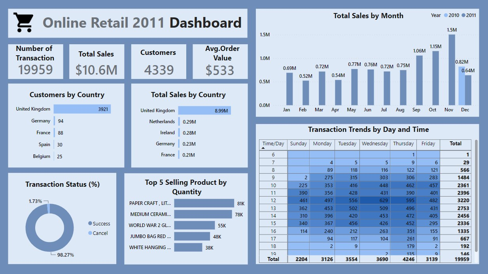

# Online Retail Analysis 

---
## Introduction
Welcome to my first project portfolio! In this portfolio, I am excited to present my work on a SQL and Power BI project focused on analyzing online retail data for a UK-based non-store online retailer. The dataset comprises transactions recorded between December 1, 2010, and December 9, 2011. The retailer specializes in selling unique gifts suitable for various occasions, with a significant portion of its customer base consisting of wholesalers.

## Project Objectives:
The primary objectives of this analysis are as follows:
- To gain valuable insights into the retail operations, customer behavior, and sales trends,
- To answer key questions and provide data-driven recommendations for decision-makers,
- To showcase the capabilities of SQL and Power BI in extracting insights from real-world retail data.

**_Disclaimer:_**
_It is important to note that this report is solely intended to demonstrate the capabilities of SQL and Power BI for data analysis and does not represent any specific company or organization._

## Dataset Source:
The dataset used for this project is in CSV format and can be accessed on Kaggle at the following link [here](https://www.kaggle.com/datasets/ulrikthygepedersen/online-retail-dataset). This is a table containing transaction records for a specific period and serves as the main data source for analysis.

## Methods Employed
For this project, I employed a combination of SQL and Power BI for data analysis:

- SQL was used for data cleaning, transformation, and aggregation.
- Power BI was utilized to create interactive and informative visualizations.

## Data Cleaning and Preprocessing
The dataset underwent comprehensive data cleaning and preprocessing steps, including:

- Addressing NULL values.
- Data type conversions.
- Deleting Irrelevant Rows
- Creat additional columns 
- Dealing with duplicate rows in the dataset.

The SQL script used for data cleaning and preprocessing can be found 

## Visualization

## Analysis and Insights
- __Number of Transactions__:In the period from December 1, 2010, to December 9, 2011, the dataset recorded a total of 19,959 successful unique transactions, illustrating the extent of customer engagement during this time.
- __Total Sales__:The total sales for the one-year period, spanning December 1, 2010, to December 9, 2011, amounted to $10.9 million, providing a comprehensive overview of annual revenue.
- __Customer__:Excluding cancellations, the analysis revealed 4,339 distinct customers who participated in transactions between December 1, 2010, and December 9, 2011, shedding light on the size and diversity of the customer base.
- __Average Order Value__:The average order value for this year was $533, offering insight into typical customer spending behavior over the entire year.
- __Total Sales by Month__:A monthly sales trend analysis revealed fluctuations throughout the year, with November 2011 as the highest-grossing month and February 2011 as the lowest. These trends can inform demand forecasting and inventory management strategies.
- __Customers by Country__:The analysis identified the United Kingdom as the country with the highest number of customers, highlighting a significant domestic customer base.
- __Total Sales by Country__:The United Kingdom emerged as the top contributor to total sales, underlining its significance within the market.
- __Top 5 Selling Products by Quantity__:The analysis pinpointed the best-selling products by quantity, with "Paper Craft, Small Birdie" leading the pack, followed by "Medium Ceramic Top Storage Jar," "World war 2 glider asstd design," "Jumbo bag red retro spot," and "White hanging heart t-light holder." This knowledge can guide inventory management and marketing decisions.
- __Transaction Status(%)__:Transaction statuses were distributed with 98.27% of transactions being successful and 1.73% as cancellations, providing an overview of transaction outcomes and potential areas for improvement.
- __Transaction Trends by Day and Time__: Use the Heatmap table to analyze transaction data to identify patterns in customer behavior throughout the week and within a 24-hour period. The analysis shows that Thursdays are consistently the busiest days of the week for transactions, and noon is the highest transaction volume on a daily basis; this information highlights the specific day of the week and time of day when most transactions occur.
  
## Recommendations
1. Advertise more during popular shopping months like November.
2. Make sure popular items are available online.
3. Focus on UK customers with special deals.
4. Explore selling to other countries.
5. Have more workers available on Thursdays and around 12 noon.
6. Offer great customer service and loyalty programs.
7. Accept various online payment methods and currencies.
8. Find why people leave their online carts and make the process smoother.
9. Suggest related items to boost online order values.
10. Keep an eye on online sales trends for better decisions.

--------------
Analyze transaction trends by both day of the week and time of the day.showing the number of transactions for each day of the week and hour of the day, excluding cancellations. You can analyze this data to identify patterns and peak transaction times during the week.

total sales by month ,showcase how sales have evolved throughout the year. This information can be invaluable for business decision-making, such as identifying peak sales periods, evaluating the effectiveness of marketing campaigns, and forecasting future sales based on historical trends.total sales amounts for each month, which is valuable for analyzing sales trends over time.

